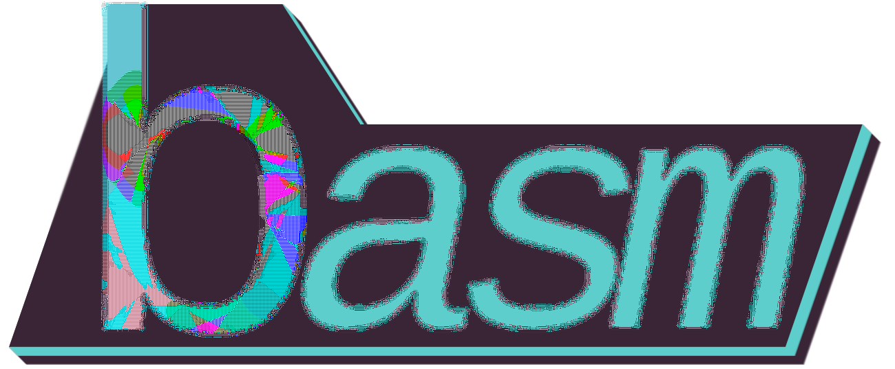

# A Quick Introduction and Reference to Brain Aneurysm Programming Language

This repository serves to publish the basm book in a readable and accessible format through github pages.
The source code for this book created with mdbook is available [in this repository](https://github.com/AtmolanderMimi/basm).
Please look over there for information about the language and compiler.
The book should be manually updated every time content is added to it.

The basm book serves as a short introduction and reference to the Brain Aneurysm programming language v1.0.

To read, head over to: [https://AtmolanderMimi.github.io/basm-book]

## License
The contents of this repository are licensed under the [`MIT` license](https://opensource.org/license/mit) and the [Apache License (Version 2.0)` license](https://opensource.org/license/apache-2-0).

You can see these licenses in this repository. Both [MIT](./LICENSE-MIT) and [Apache 2.0](./LICENSE-APACHE) are available in text format.

started as of 2024-10-12
